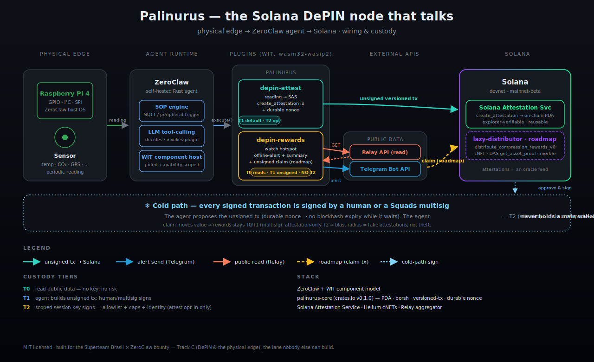
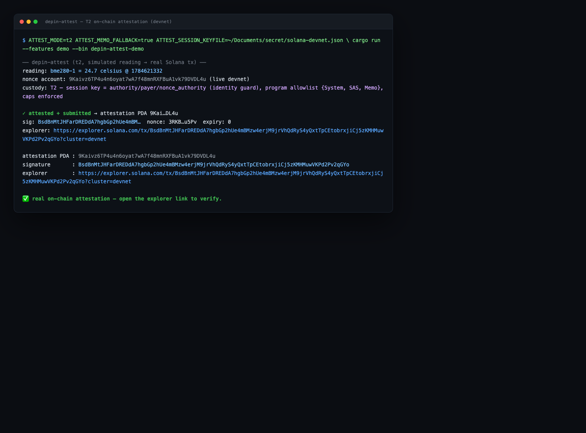
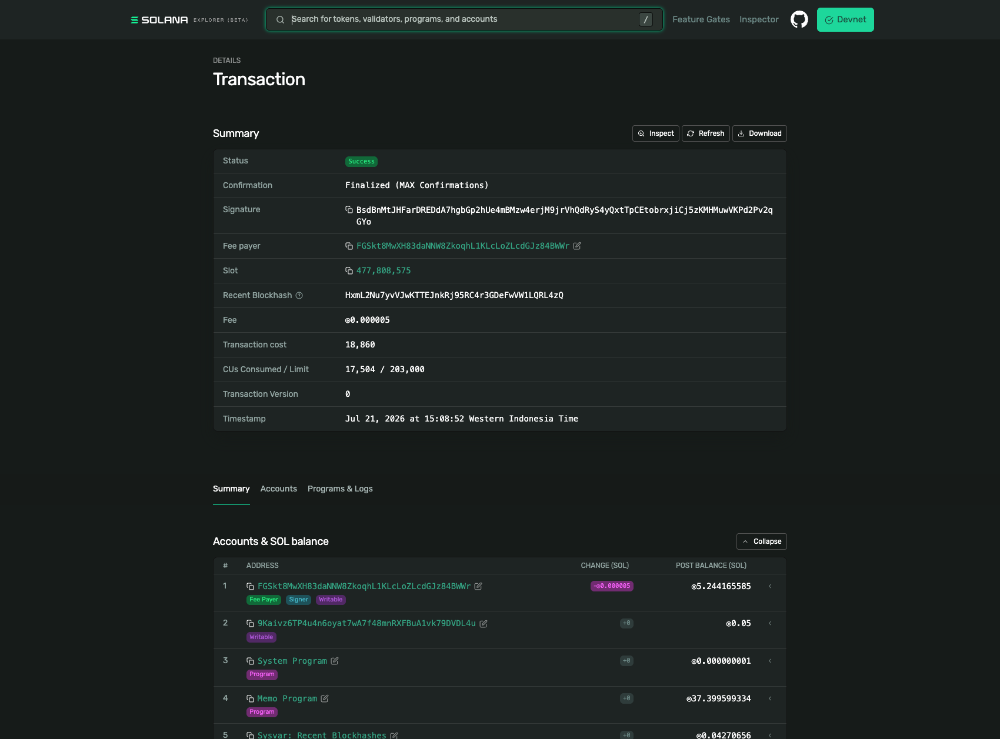
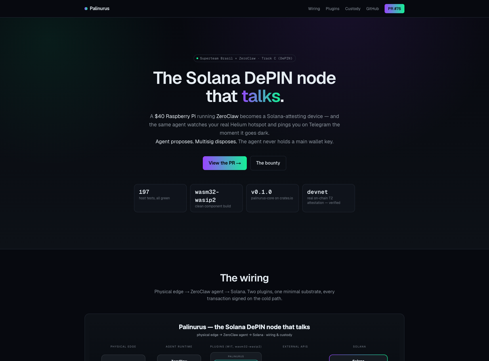

<div align="center">

# 🦞 Palinurus

**The Solana DePIN node that talks.** A navigator at the physical edge, attesting back to the chain.

*A ZeroClaw agent on a \$40 Raspberry Pi becomes a Solana-attesting, reward-watching DePIN node — the agent proposes, a human/Squads multisig disposes, no main key ever leaves the cold path.*

[](https://superteam.fun/earn/listing/zeroclaw)
[](#custody-at-a-glance)
[](#build--test)
[](https://crates.io/crates/palinurus-core)
[](#live-on-devnet)
[](LICENSE)
[](https://palinurus.rectorspace.com)

</div>

<div align="center">



</div>

> Built for the [Superteam Brasil × ZeroClaw bounty](https://superteam.fun/earn/listing/zeroclaw) — *"Build Solana-native plugins for Zeroclaw 🦞"*. **Track C (DePIN & the physical edge)**, the sponsor's favorite: *"the one nobody else can build."*

Palinurus is a suite of Solana-native tool plugins for [ZeroClaw](https://github.com/zeroclaw-labs/zeroclaw) — the self-hosted, Rust-based AI agent runtime (32k ⭐) — built as `wasm32-wasip2` WIT components against the ZeroClaw plugin contract. It brings real Solana capability to an autonomous agent that runs on your own hardware, with your own keys.

---

## Table of contents

- [Why](#why)
- [What's here](#whats-here)
- [Status](#status)
- [Live on devnet](#live-on-devnet) — real on-chain proof
- [Wiring](#wiring)
- [Marketing site](#marketing-site)
- [Build & test](#build--test)
- [License](#license)

---

## Why

ZeroClaw runs on a Raspberry Pi with GPIO/I2C/SPI and an SOP engine triggered by MQTT and by peripherals. It's already a DePIN device — it just has no chain. Palinurus is the bridge: the navigator that takes a reading from the physical edge and commits a verifiable attestation back to Solana. A \$40 Pi becomes a Solana-reporting device.

The thesis: an agent with a private key and an LLM in the loop is a hot wallet with a prompt-injection surface. Palinurus treats custody as a first-class engineering problem — the agent proposes, a human or multisig disposes, and signing (when it happens at all) is scoped to a session key holding cents and constrained to a strict program allowlist.

## What's here

| Crate | What it does | Custody |
|---|---|---|
| `palinurus-core` | The shared `wasm32-wasip2`-friendly Solana substrate the plugins import: PDA derivation, base58, borsh, versioned-tx construction, durable-nonce handling, RPC over the host's `wasi:http`, response shaping. Pure-core/thin-shim, host-tested, MIT, crates.io-published. | — |
| `depin-attest` | Take a sensor reading (from the host's hardware via the SOP engine), commit a periodic attestation on-chain via the [Solana Attestation Service](https://attest.solana.com/) (or memo fallback), with a durable-nonce replay guard. 74 host tests, wasm clean. **T2 path verified live on devnet.** | T1 (unsigned, multisig signs) default + T2 (autonomous, scoped session key) opt-in **— verified on devnet** |
| `depin-rewards` | Watch a public Helium hotspot (no ownership required) for online/offline flips + rewards; fire real Telegram alerts; draft an unsigned rewards-claim tx. 52 host tests, wasm clean, **no signing key anywhere in the crate**. | T0 (reads + alerts) + T1 (unsigned claim, roadmap). No T2 |

> A stream of signed attestations from a stable key *is* an oracle feed — the `depin-attest` README documents how to consume the attestation stream as an oracle, rather than shipping a separate `oracle-publish` component. Depth over breadth, per the bounty's guidance.

### Custody at a glance

| Plugin | Reads (T0) | Unsigned tx (T1) | Autonomous sign (T2) |
|---|---|---|---|
| `depin-attest` | — | ✅ durable-nonce attestation | ✅ opt-in, scoped session key, allowlist + caps — **verified on devnet** |
| `depin-rewards` | ✅ Relay + Telegram | 📋 unsigned claim tx (design documented, deferred) | ❌ never (claim moves value → multisig) |

The agent never holds a main wallet key. Pattern: *agent proposes, multisig disposes.*

## Status

✅ **Phase 0–4 complete.** `palinurus-core` v0.1.0 is live on crates.io (PDA derivation hand-rolled from `sha2` + `curve25519-dalek` — `solana-sdk`/`solana-program` can't compile for `wasm32-wasip2`, so we rebuilt `find_program_address` and cross-checked it byte-for-byte against `solana_program` and `@solana/web3.js`). Both plugins are implemented and live on [PR #76](https://github.com/zeroclaw-labs/zeroclaw-plugins/pull/76) to `zeroclaw-labs/zeroclaw-plugins` — **197 host tests** across the trio, all `clippy -D warnings` + `wasm32-wasip2` clean. The `depin-attest` T2 custody path is **verified live on devnet** — a real, explorer-verifiable on-chain attestation.

- **`depin-rewards` rewards path is verified live** against the real Relay API on the free Community tier (the live smoke test surfaced & fixed 3 real bugs the mocked tests couldn't catch — see the plugin README).
- **`depin-rewards` claim tx is deferred** by design: Helium hotspots are compressed NFTs, so the claim is `distribute_compression_rewards_v0` + a DAS `get_asset_proof` merkle proof — a focused multi-session effort, not a rushed slice. The homework is done; impl is the next milestone.

🚧 **Phase 5 in progress** — the demo video + Superteam submission. Phase 4 done: wiring diagram ✅, marketing site ✅ ([palinurus.rectorspace.com](https://palinurus.rectorspace.com)), demo recording guide ✅, demo drivers ✅ (live-verified). **Submit by Aug 7 2026; winner announced Aug 21 2026.**

## Live on devnet

The `depin-attest` T2 custody path is **verified on Solana devnet** — a real, explorer-verifiable attestation, not an unsigned draft.

<p align="center"><em>The T2 demo driver — signs + submits on camera:</em></p>



<p align="center"><em>The confirmed transaction on Solana explorer (Success · Finalized):</em></p>



- tx [`BsdBnMtJ…2qGYo`](https://explorer.solana.com/tx/BsdBnMtJHFarDREDdA7hgbGp2hUe4mBMzw4erjM9jrVhQdRyS4yQxtTpCEtobrxjiCj5zKMHMuwVKPd2Pv2qGYo?cluster=devnet) · **Success / Finalized** · slot `477808575` · fee `0.000005` SOL · version `0` (versioned tx → durable nonce)
- durable nonce advanced `F3tGxZwV… → HxmL2Nu7…` (replay guard live) · reading committed on-chain as a memo: `palinurus: bme280-1=24.7celsius @ 1784621332`
- custody guards enforced **before signing**: session-key identity · program allowlist `{System, SAS, Memo}` · lamport cap · daily cap

> **SAS vs memo path.** The default is the **memo program** (cheap, high-throughput — the landed proof above). The **SAS** path (`create_attestation`, verifiable + credential-bound) builds the instruction + derives the PDA, but on-chain landing is blocked on schema creation (SAS `0x4` — a stale-arg issue against `sas-lib@1.0.10`'s `getCreateSchemaInstruction`; the credential creates cleanly). SAS ix + PDA are tested + cross-checked via TS oracles. On-chain SAS landing is the next milestone.

## Wiring


A \$40 Raspberry Pi running ZeroClaw hosts two Palinurus WIT plugins. `depin-attest` turns a sensor reading into a Solana Attestation Service attestation (unsigned tx → human/multisig signs). `depin-rewards` watches any public Helium hotspot via the Relay API and fires Telegram alerts the moment it goes dark. The agent never holds a main wallet key — see the cold path across the bottom.

## Marketing site

<p align="center">
<a href="https://palinurus.rectorspace.com"></a>
</p>

Live at **[palinurus.rectorspace.com](https://palinurus.rectorspace.com)** — Next.js 16 + Tailwind 4, dark mode, auto-deployed from `main` via Vercel.

## Build & test

```bash
rustup target add wasm32-wasip2
cargo test                                  # 197 host tests, no wasm toolchain needed
cargo build --release --target wasm32-wasip2 # the core compiles to the component target
```

The plugin + demo driver source, the recording guide, and the full custody + injection transcripts live in the [PR #76](https://github.com/zeroclaw-labs/zeroclaw-plugins/pull/76) repo (`plugins/depin-attest`, `plugins/depin-rewards`).

## License

MIT. Palinurus is named for *Palinurus* — the spiny-lobster genus and Virgil's helmsman-navigator in the *Aeneid*, who reported from beyond the edge.